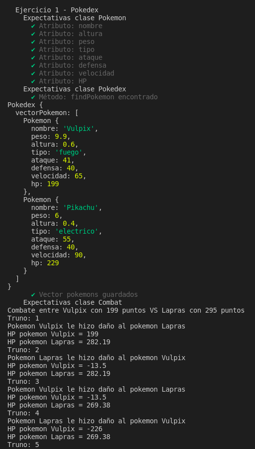
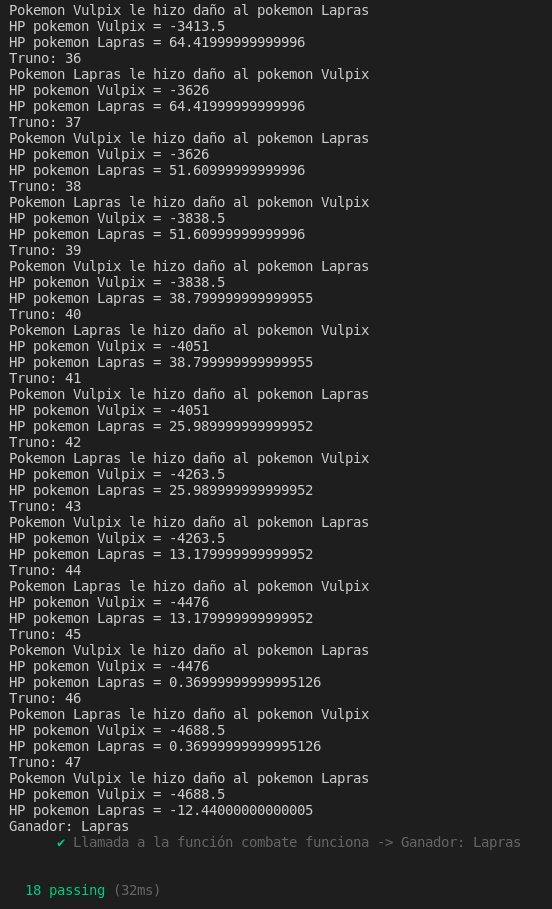

## Informe práctica 5: Objetos, clases e interfaces

Noelia Ibáñez Silvestre

alu0101225555

### Tareas previas

Antes de comenzar, configuramos el entorno de trabajo correctamente y aceptamos la asignación de la tarea. 
**Nota**: Se produce un error en el fichero `tsconfig.json` si lo configuramos de manera manual y para solucionar esto, ejecutamos `tsc --init` y activamos o desactivamos las opciones directamente.

### Ejercicio 1 - Pokedex

**Enunciado**: Se pide crear una `Pokedex` donde se almacene la información relacionada con distintos Pokemons. Para cada Pokemon, se deben almacenar los siguientes elementos de información:

1. Nombre
2. Peso y altura
3. Tipo
4. Estadísticas básicas: ataque, defensa, velocidad y daño máximo (HP)

Por último, diseñe una clase `Combat` que simule el combate entre dos Pokemons. Para ello, un objeto de dicha clase deberá ser construido con dos contrincantes. Además, reescriba la función del Ejercicio 8 de la Práctica 3 como un método de esta clase. Incluya también un método `start` dentro de la clase `Combat` que realice la simulación del combate. Este método se basará en lo siguiente:

- Se realizarán ataques entre los contrincantes hasta que el daño sufrido por uno de ellos sea igual o superior a su HP.
- Se considera que el primero de los contrincantes que recibe un objeto de la clase Combat será siempre el primero en realizar un ataque.
- El método deberá mostrar por pantalla la evolución del combate. Esto es, después de cada ataque se debe mostrar el estado de HP de cada contrincante.

**Desarrollo**:

*Clase Pokemon*:

```
export class Pokemon {

    /**
     * @param nombre es el nombre del pokemon
     * @param peso es el peso del pokemon
     * @param altura es la altura del pokemon
     * @param tipo es el tipo del pokemon: agua, fuego, hierba o electricidad
     * @param ataque puntos ataque pokemon
     * @param defensa puntos defensa pokemon
     * @param velocidad velocidad pokemon
     * @param hp puntos daño máximo pokemon
     */

    /**
     * Constructor simplificado con todos los atributos privados
     */
    constructor (private nombre: string, private peso: number, private altura: number,  private tipo: string, private ataque: number,  private defensa: number,  private velocidad: number,  private hp: number) {
        this.nombre = nombre;
        this.peso = peso;
        this.altura = altura;
        this.tipo = tipo;
        this.ataque = ataque;
        this.defensa = defensa;
        this.velocidad = velocidad;
        this.hp = hp;
    }

    /**
     * 
     * @returns nombre del pokemon
     */
    getNombre() { 
        return this.nombre; 
    }

    /**
     * 
     * @returns peso del pokemon
     */
    getPeso() {
        return this.peso;
    }

    /**
     * 
     * @returns altura del pokemon
     */
    getAltura() {
        return this.altura;
    }

    /**
     * 
     * @returns tipo de pokemon
     */
    getTipo() {
        return this.tipo;
    }

    /**
     * 
     * @returns puntos de ataque del pokemon
     */
    getAtaque() {
        return this.ataque;
    }

    /**
     * 
     * @returns puntos de defensa del pokemon
     */
    getDefensa() {
        return this.defensa;
    }

    /**
     * 
     * @returns velocidad del pokemon
     */
    getVelocidad() {
        return this.velocidad;
    }

    /**
     * 
     * @returns puntos daño máximo del pokemon
     */
    getHp() {
        return this.hp;
    }

    /**
     * Método que modifica el valor HP de un pokemon
     * @param hp nuevo valor HP 
     */
    setHP(hp: number) {
        this.hp = hp;
    }
}
```

En primer lugar, creamos una clase `Pokemon` que contendrá todos los parámetros descriptivos de cada pokemon. Los atributos especificados en el constructor son de tipo privado, por ello es necesario establecer los 'getters' para poder acceder. 
Una vez tenemos dicha clase, creamos la clase `Pokedex` que será una especie de base de datos que contendrá los pokemons que hemos ido añadiendo. En este método, solo tenemos que pasale un parámetro privado que corresponde con el nombre del pokemon que queremos buscar o añadir.
*Clase Pokedex*:

```
/**
 * Clase para guardar pokemons en un vector (Pokedex)
 */
export class Pokedex {

    constructor (private vectorPokemon: Pokemon []) {
        this.vectorPokemon = vectorPokemon;
    }

    /**
     * 
     * @returns valor vector pokemon
     */
    getVectorPokemon() {
        return this.vectorPokemon;
    }  

    /**
     * Método para introducir un pokemon en el vector de pokemons
     * @param pok pokemon a añadir al vector
     */
    setPokemon(pok: Pokemon) {
        this.vectorPokemon.push(pok);
    }

    /**
     * Método para buscar unn pokemon
     * @param pok pokemon a buscar
     * @returns true si encuentra al pokemon en el vector ó false si no lo encuentra
     */
    findPokemon(pok: Pokemon) {
        return this.vectorPokemon.includes(pok); //devulve true si lo encuentra
    }

    /**
     * Imprime el vector de pokemons
     */
    printVectorPokemon() {
        console.log(this.vectorPokemon);
    }
    
}
```

Por último, creamos la clase `Combat` que simulará un combate entre 2 pokemons y es la clase más importante, junto a la clase `Pokemon`. Para ello, definimos el constructor con dos pokemons que le pasamos a la función (`pokA` y `pokB`). A continuación, definimos la función `daño` que es la misma que usamos en el ejercicio 8 de la práctica 3 aunque la reescribimos ya que nos ocasiona un conflicto en el tipo de parámetros que devuelve y que debemos usar en el siguiente método. Para solucionar esto, definimos la efectividad según los pokemons que se enfrenten y se calcula al final el daño ocasionado, además, debemos convertir a flotante. Para finalinalizar con esta clase, definimos la función `start` que será la encargada de ir iterando y llamando a la función `daño` hasta obtener un ganador. 

*Clase Combat*:

```
export class Combat {

    constructor( private pokA: Pokemon, private pokB: Pokemon) {
        this.pokA = pokA;
        this.pokB = pokB;
    };

    /**
     * Método para calcular el daño entre 2 pokemons
     * @param tipoA tipo del primer pokemon
     * @param tipoB tipo del segundo pokemon
     * @param ataqA ataque del pokemon A
     * @param defB defensa del pokemon B
     * @returns devuelve el daño final 
     */
    daños(tipoA: string, tipoB: string, ataqA: number, defB: number): number {
        let super_efectivo = 2; //= 50 * (ataqA / defB) * 2;
        let neutral = 1; //= 50 * (ataqA / defB);
        let poco_efectivo = 0.5//: number = 50 * (ataqA / defB) * 0.5;
        let efectividad = 0;
        let dañoF = 0;

        if (tipoA == tipoB) {
            efectividad = poco_efectivo;
        }

        if (tipoA == 'fuego') {
            if (tipoB == 'agua')
                efectividad = poco_efectivo
            if (tipoB == 'hierba')
                efectividad = super_efectivo
            if (tipoB == 'electrico')
                 efectividad = neutral
        }

        if (tipoA == 'agua') {
            if (tipoB == 'fuego')
               efectividad = super_efectivo
            if (tipoB == 'hierba')
               efectividad = poco_efectivo
            if (tipoB == 'electrico')
               efectividad = poco_efectivo        
        }

        if (tipoA == 'hierba') {
            if (tipoB == 'fuego')
               efectividad = poco_efectivo
            if (tipoB == 'agua')
               efectividad = super_efectivo
            if (tipoB == 'electrico')
               efectividad = neutral        
        }

        if (tipoA == 'electrico') {
            if (tipoB == 'fuego')
               efectividad = neutral
            if (tipoB == 'agua')
               efectividad = super_efectivo 
            if (tipoB == 'hierba')
                efectividad = neutral        
        }

        dañoF = 50 * (ataqA / defB) * efectividad;
        return parseFloat(dañoF.toFixed(2));
    }

    /**
     * Método para comenzar una batalla entre 2 pokemons
     * @returns pokemon ganador
     */
    start() {
        //let salud_acabada: boolean = false;
        let turno: number = 1;
        let ganador: string = "";

        console.log(`Combate entre ${this.pokA.getNombre()} con ${this.pokA.getHp()} puntos VS ${this.pokB.getNombre()} con ${this.pokB.getHp()} puntos`);

        while((this.pokA.getHp() > 0) || (this.pokB.getHp() > 0)) {
            let daño: number = 0;

            console.log(`Truno: ${turno}`);

            if(turno % 2 != 0) {
                daño = this.daños(this.pokA.getTipo(), this.pokB.getTipo(), this.pokA.getAtaque(), this.pokB.getDefensa());
                this.pokB.setHP(this.pokB.getHp() - daño);
                console.log(`Pokemon ${this.pokA.getNombre()} le hizo daño al pokemon ${this.pokB.getNombre()}`);
                console.log(`HP pokemon ${this.pokA.getNombre()} = ${this.pokA.getHp()}`);
                console.log(`HP pokemon ${this.pokB.getNombre()} = ${this.pokB.getHp()}`);
            }else {
                daño = this.daños(this.pokB.getTipo(), this.pokA.getTipo(), this.pokB.getAtaque(), this.pokA.getDefensa());
                this.pokA.setHP(this.pokA.getHp() - daño);
                console.log(`Pokemon ${this.pokB.getNombre()} le hizo daño al pokemon ${this.pokA.getNombre()}`);
                console.log(`HP pokemon ${this.pokA.getNombre()} = ${this.pokA.getHp()}`);
                console.log(`HP pokemon ${this.pokB.getNombre()} = ${this.pokB.getHp()}`);
            }

            if(this.pokA.getHp() <= 0) {
                ganador = this.pokB.getNombre();
            }else {
                ganador = this.pokA.getNombre();
            }

            turno ++;
        }

        console.log(`Ganador: ${ganador}`);
        return ganador;
    }  
}
```

### Test y resultado final

Además de llevar acabo la documentación correspondiente, realizamos los test oportunos y generamos la siguiente salida por pantalla:





### Conclusión

En la realización de esta práctica me he encontrado con algunas dificultades pero más orientadas al trabajo con diferentes tipos de datos que al objetivo principal de esta práctica, que era trabajar con objetos y clases. 

### Enlaces

- [src](/home/usuario/ull-esit-inf-dsi-21-22-prct05-objects-classes-interfaces-alu0101225555/src)

- [documentación](/home/usuario/ull-esit-inf-dsi-21-22-prct05-objects-classes-interfaces-alu0101225555/docs)

- [test](/home/usuario/ull-esit-inf-dsi-21-22-prct05-objects-classes-interfaces-alu0101225555/tests)
